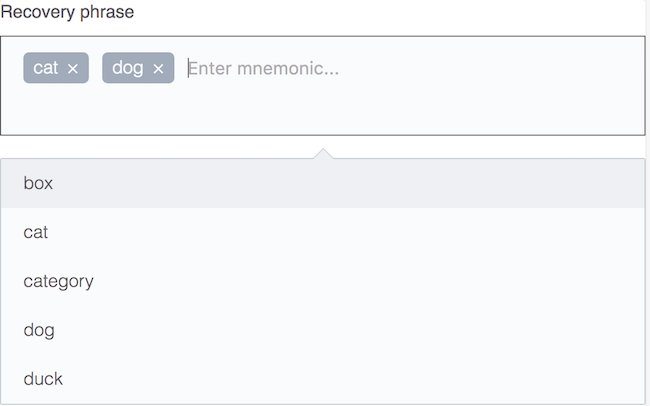

# React Polymorph

React Polymorph is a UI framework for React, that separates logic, markup and theming of components.
It's inspired by [react-toolbox](https://github.com/react-toolbox/react-toolbox/) (but more flexible), powered by [CSS Modules](https://github.com/css-modules/css-modules) and harmoniously integrates with
your [webpack](http://webpack.github.io/) workflow, although you can use any other module bundler.

## Why?

- Existing React UI frameworks are too hard to customize.
- Overriding css styles is not enough for complex components.
- You need multiple variations of a component with shared logic.
- You need multiple, completely unique themes for your components.

## How:

Separate monolithic React components into:

1. **Component** (logic) - Only handle UI logic, do not render markup.
2. **Skin** (markup) - Only render the markup, delegate to component.
3. **Theme** (styling) - Only concerned about styling your skin.


## Installation & Usage

React Polymorph can be installed as an [npm package](https://www.npmjs.com/package/react-polymorph):

`$ npm install --save react-polymorph`

### Usage in Webpack Projects

```bash
npm install --save style-loader css-loader sass-loader
```

```js
module: {
  loaders: [
    {
      test: /\.scss$/,
      loaders: [
        'style?sourceMap',
        'css?sourceMap&modules&localIdentName=[name]_[local]&importLoaders=1',
        'sass?sourceMap'
      ]
    },
    // your other loaders …
  ]
},
```

Now you can import and use components like this in your app:

```javascript
import React from 'react';
import Input from 'react-polymorph/lib/components/Input';
import InputSkin from 'react-polymorph/lib/skins/simple/InputSkin';

// Basic input component:
const MyInput = () => <Input skin={InputSkin} />;
```

Depending on the *skin* you apply to your component it will pick the associated
theme (in this case it's the `simple` theme that is bundled with `react-polymorph`).
However you can also completely customize the theme of components.

### Components and Skins

Imagine you need a standard text `Input` component for text and a `NumericInput`
for floating point numbers. The only difference is the logic of the component,
in both cases it is "just" an input field showing some text:

#### Standard Input

The standard input is as simple as possible and does not have much logic:

```javascript
import React from 'react';
import Input from 'react-polymorph/lib/components/Input';
import InputSkin from 'react-polymorph/lib/skins/simple/InputSkin';

// Standard input component:
const MyStandardInput = (props) => (
  <Input
    skin={InputSkin}
    label="Input with max. 5 Characters"
    maxLength={5}
  />
);
```


#### Numeric Input

The numeric input however is specialized in guiding the user to
enter correct floating point numbers:

```javascript
import React from 'react';
import NumericInput from 'react-polymorph/lib/components/NumericInput';
import InputSkin from 'react-polymorph/lib/skins/simple/InputSkin';

const MyNumericInput = (props) => (
  <NumericInput // notice the different logic component!
    skin={InputSkin} // but the same skin!
    label="Amount"
    placeholder="0.000000"
    maxBeforeDot={5}
    maxAfterDot={6}
    maxValue={30000}
    minValue={0.000001}
  />
);
```


This is a simple example that shows how you can make/use specialized versions
of basic components by composition - a core idea of `react-polymorph`!

#### Textarea

The textarea is as simple as possible and does not have much logic:

```javascript
import React from 'react';
import TextArea from 'react-polymorph/lib/components/TextArea';
import TextAreaSkin from 'react-polymorph/lib/skins/simple/TextAreaSkin';

const MyTextArea = (props) => (
  <TextArea
    skin={TextAreaSkin}
    label="Textarea with fixed amount of rows to start with"
    placeholder="Your description here"
    rows={5}
  />
);
```


#### Button

The button is as simple as possible and does not have much logic:

```javascript
import React from 'react';
import Button from 'react-polymorph/lib/components/Button';
import ButtonSkin from 'react-polymorph/lib/skins/simple/ButtonSkin';

const MyButton = (props) => (
  <Button
    label="Button label"
    skin={ButtonSkin}
  />
);
```


#### Select

The select component is like standard select but with additional logic for adding custom option renderer and opening directions (upward / downward):

```javascript
import React from 'react';
import Select from 'react-polymorph/lib/components/Select';
import SelectSkin from 'react-polymorph/lib/skins/simple/SelectSkin';

const MySelect = (props) => (
  <Select
    label="Countries"
    options={OPRIONS_ARRAY}
    optionRenderer={(option) => {
      return (
        <div className={styles.customOptionStyle}>
          
          <span>{option.label}</span>
        </div>
      );
    }}
    skin={SelectSkin}
  />
);
```


#### Checkbox

The checkbox is as simple as possible and does not have much logic:

```javascript
import React from 'react';
import Checkbox from 'react-polymorph/lib/components/Checkbox';
import CheckboxSkin from 'react-polymorph/lib/skins/simple/CheckboxSkin';

const MyCheckbox = (props) => (
  <Checkbox
    label="My checkbox"
    skin={CheckboxSkin}
  />
);
```


#### Switch

The switch is as simple as possible and does not have much logic. Like checkbox but uses a different skin part:

```javascript
import React from 'react';
import Checkbox from 'react-polymorph/lib/components/Checkbox';
import SwitchSkin from 'react-polymorph/lib/skins/simple/SwitchSkin';

const MySwitch = (props) => (
  <Checkbox
    label="My switch"
    skin={SwitchSkin}
  />
);
```


#### Toggler

The toggler is as simple as possible and does not have much logic. Like checkbox but uses a different skin part:

```javascript
import React from 'react';
import Checkbox from 'react-polymorph/lib/components/Checkbox';
import TogglerSkin from 'react-polymorph/lib/skins/simple/TogglerSkin';

const MyToggler = (props) => (
  <Checkbox
    labelLeft="Included"
    labelRight="Excluded"
    skin={TogglerSkin}
  />
);
```


#### Modal

The modal is component which wraps its children as standard dialog. As is shown in example, modal can have multiple other polymorph components:

```javascript
import React from 'react';
import Modal from 'react-polymorph/lib/components/Modal';
import ModalSkin from 'react-polymorph/lib/skins/simple/ModalSkin';
import ButtonSkin from 'react-polymorph/lib/skins/simple/ButtonSkin';

const MyModal = (props) => (
  <Modal
    triggerCloseOnOverlayClick={false}
    skin={ModalSkin}
  >
    <h1 className={styles.modalTitle}>
      Are you sure you want to delete this thing?
    </h1>
    <div className={styles.buttonsContainer}>
      <Button
        label="Cancel"
        onClick={closeModalCallback}
        skin={ButtonSkin}
      />
      <Button
        label="Delete"
        onClick={closeModalCallback}
        skin={ButtonSkin}
      />
    </div>
  </Modal>
);
```


#### Autocomplete

The autocomplete input is specialized to help users to select between multiple suggested words depending on entered letters:

```javascript
import React from 'react';
import Autocomplete from 'react-polymorph/lib/components/Autocomplete';
import AutocompleteSkin from 'react-polymorph/lib/skins/simple/AutocompleteSkin';

const MyAutocomplete = (props) => (
  <Autocomplete
    label="Recovery phrase"
    placeholder="Enter recovery phrase"
    suggestedWords = {SUGGESTED_WORDS}
    placeholder="Enter mnemonic..."
    maxSelections={12}
    maxVisibleSuggestions={5}
    invalidCharsRegex= {/[^a-zA-Z]/g}
    skin={AutocompleteSkin}
  />
);
```



### Customizing Component Skins

Every component accepts a `theme` property intended to provide a [CSS Module import object](https://github.com/css-modules/css-modules) that will be used by the component to assign local classnames to its DOM nodes. Therefore, each one implements a documented **classname API**. So if you want to customize a component, you just need to provide a theme object with the appropriate classname mapping.

If the component already has a theme injected, the properties you pass will be merged with the injected theme. In this way, you can **add** classnames to the nodes of a specific component and use them to add or to override styles. For example, if you want to customize the `AppBar` to be purple:

```js
import React from 'react';
import { Button } from 'react-polymorph/lib/components/Button';
import { ButtonSkin } from 'react-polymorph/lib/skins/simple/ButtonSkin';
import theme from './GreenButton.css';

const GreenButton = (props) => (
  <Button {...props} skin={ButtonSkin} theme={theme} />
);

export default GreenButton;
```

```css
.root {
  background-color: green;
}
```

In this case we are **adding** styles to a specific instance of an `ButtonSkin` component that already has its default styles injected. If the component has no styles injected, you should provide a theme object implementing the full API. You are free to require the CSS Module you want but take into account that every classname is there for a reason. You can either provide a theme via prop or via context as described in the next section.

### Customizing all instances of a Component Skin

Install [react-css-themr](https://github.com/javivelasco/react-css-themr) with `npm install react-css-themr --save`

Create a CSS Module theme style file for each component type, for example for `Button`:

```css
# /css/button.css

.root {
  text-transform: uppercase;
}
```

Create a theme file that imports each component's custom theme style under the special theme key listed in that widgets's documentation, i.e.:

```js
# theme.js

import { BUTTON } from 'react-polymorph/lib/skins/simple/identifiers';
import MyCustomButtonTheme from './css/button.css';

export default {
  [BUTTON]: MyCustomButtonTheme
};
```

Wrap your component tree with ThemeProvider at the desired level in your component hierarchy. You can maintain different themes, each importing differently styled css files \(i.e. `import AdminButton from './css/adminAreaButton.css'`\) and can provide each one at different points in the tree.

```js
import React from 'react';
import { ThemeProvider } from 'react-css-themr';
import theme from './theme';

class App extends React.Component {
  render() {
    return (
      <ThemeProvider theme={theme}>
        <div>
          ...
        </div>
      </ThemeProvider>
    );
  }
}
export default App;
```
